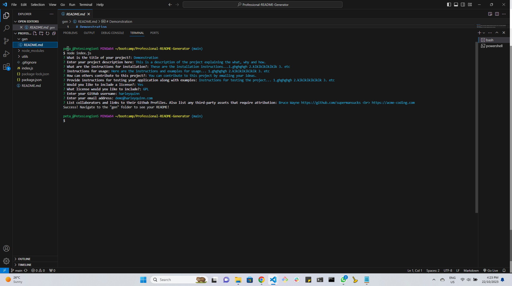
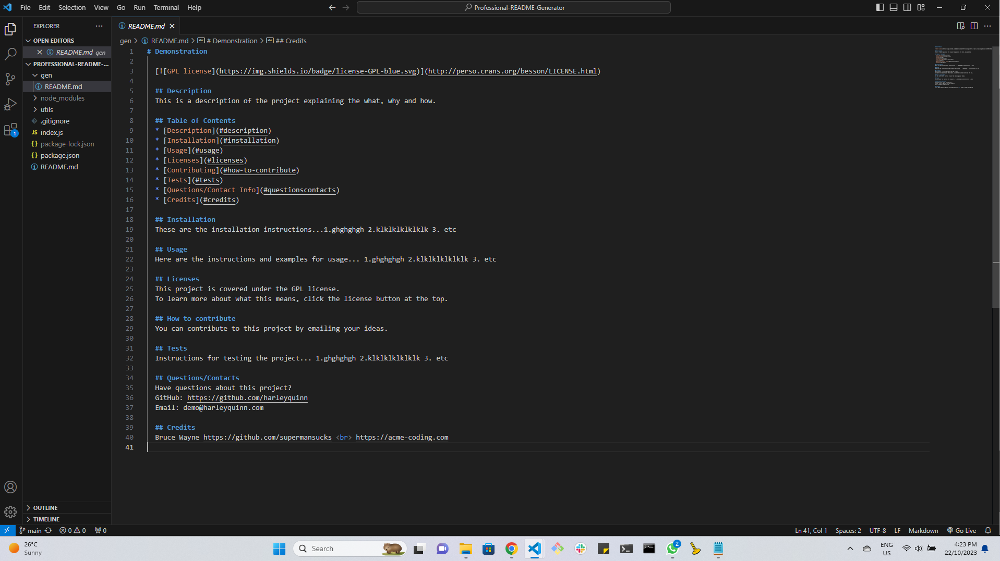
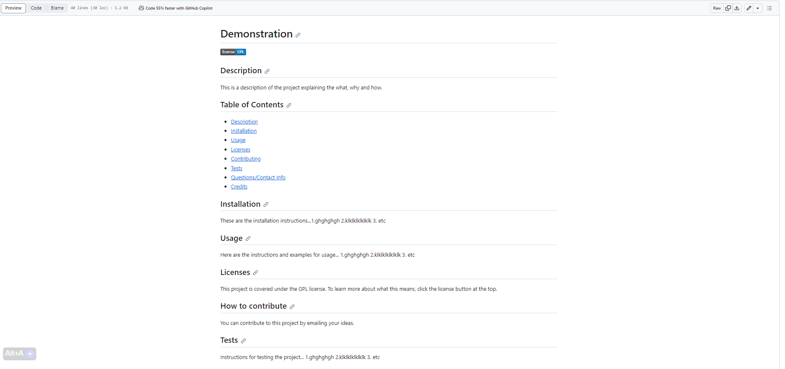

# Professional-README-Generator

 

  ## Description
  The aim of this challenge was to use create a Professional README Generator from the command-line using only Node.js.

  ## Table of Contents
  * [Description](#description)
  * [Installation](#installation)
  * [Usage](#usage)
  * [Licenses](#licenses)
  * [Contributing](#how-to-contribute)
  * [Tests](#tests)
  * [Questions/Contact Info](#questionscontacts)
  * [Credits](#credits)

  ## Installation
  The user should clone the code from this GitHub repository and download Node. This application also requires VScode (or similar), a file system and inquirer module.

  ## Usage
  Screenshots and a video demonstration of the application are below...
  
  
  
  

  ## Licenses
  This project is covered under the MIT license. 
  To learn more about what this means, click the license button at the top.

  ## How to contribute
  Please get in touch via the details below to discuss third party contributions.

  ## Tests
  N/A

  ## Questions/Contacts
  Have questions about this project?  
  GitHub: https://github.com/Petarlo  
  Email: petaswan986@gmail.com

  ## Credits
  N/A
